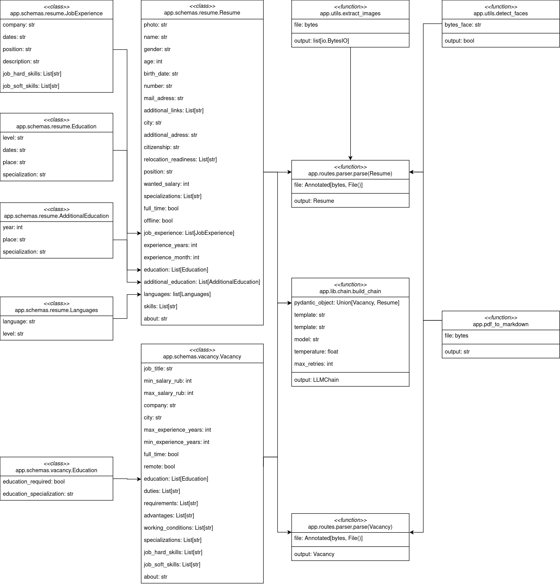

CV-Vacancy Parsing
------------------

CV-Vacancy Parser Features
==========================

Processing incoming requests for parsing resumes and vacancies and interacting with other modules to perform parsing tasks.

Requirements
============

- Python >=3.9
- pip >=22.0 or PDM >=2.4.8

Installation
============

1. Clone the repository locally.

.. code-block:: bash

    $ git clone https://github.com/expert-hr/expert-hr.git
    $ cd expert-hr/libs/hr_parser/

2. Install basic requirements.

.. code-block:: bash

    $ python -m pip install -r requirements.txt

Usage
=====

Basic usage.

.. code-block:: bash

    $ # With pdm (recommended)
    $ pdm run python -m app.run

    $ # Without pdm
    $ python -m app.run

Citation
========

.. code-block:: bash

    @software{expert-hr,
        title = {expert-hr},
        author = {Laushkina, Anastasiya and Smirnov, Ivan and Medvedev, Anatolii et al.},
        year = {2024},
        url = {https://github.com/expert-hr/expert-hr},
        version = {1.0.0}
    }

